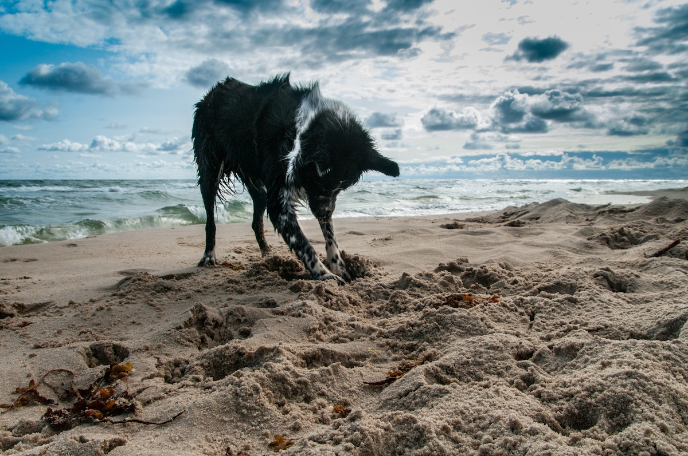
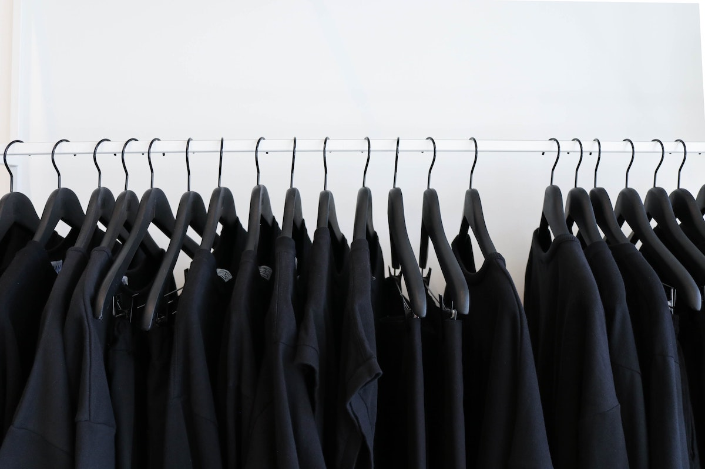
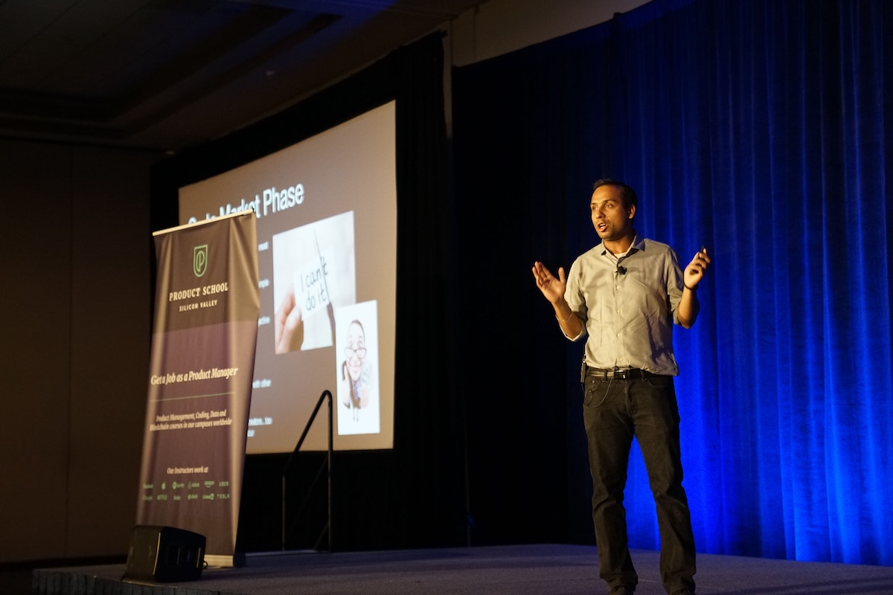

```{r setup, include=FALSE}
usethis::use_git_ignore(c("*.csv", "*.rds"))
options(htmltools.dir.version = FALSE)

library(knitr)
library(tidyverse)
library(xaringan)
library(fontawesome)
```

class: inverse, center, middle

# `r fa("fas fa-images", fill = "#fff")`

**View the slides:** 

[bretsw.com/eme6665-ss26-module5](https://bretsw.com/eme6665-ss26-module5)

---

class: inverse, center, middle

# `r fa("comments", fill = "#fff")` <br><br> Module 4 <br> Recap

---

# `r fa("comments", fill = "#fff")` Bridge

```{r, out.width = "720px", echo = FALSE, fig.align = "center"}

```

Your lit review is a **bridge between** the introduction (problem) and your research questions (what you will do)

---

# `r fa("comments", fill = "#fff")` Structure

```{r, out.width = "720px", echo = FALSE, fig.align = "center"}

```

Your problem (introduction) and conceptual foundation sections can help to **provide structure** to your lit review

---

# `r fa("comments", fill = "#fff")` Outlining

```{r, out.width = "720px", echo = FALSE, fig.align = "center"}

```

Start with an outline, then turn into topic sentences, and then complete the paragraph with evidence from multiple sources.

---

# `r fa("comments", fill = "#fff")` Digging

```{r, out.width = "720px", echo = FALSE, fig.align = "center"}

```

Your lit review is where you dig deep into what is already known (like mining)

---

# `r fa("comments", fill = "#fff")` Contrast

```{r, out.width = "720px%", echo = FALSE, fig.align = "center"}

```

Contrast (and conflicting findings in the literature) is good!

---

# `r fa("comments", fill = "#fff")` IFF

```{r, out.width = "600px", echo = FALSE, fig.align = "center"}

```

Your lit review should include only what *must* be there:

--

- "If-and-Only-If: **necessary and sufficient**"

--

- What are the "load-bearing" walls in your lit review?

---

class: inverse, center, middle

# `r fa("fas fa-feather-pointed", fill = "#fff")` <br><br> Module 5: <br> Elements of Style

---

# `r fa("fas fa-feather-pointed", fill = "#fff")` Module 5 Readings

### Galvan & Galvan, 2017, Chapter 10
*Guidelines for Writing a First Draft*

--

<hr>

**✓ Guideline 1:** Begin by Identify the Broad Problem Area, But Avoid Global Statements

--

  - *You will actually take care of this in your Introduction section of the prospectus*

--

**✓ Guideline 2:** Early in the Review, Indicate Why the Topic Being Reviewed is Important

--

  - *You should do this in an introductory paragraph at the beginning of the lit review, prior to the sections you've outlined*

--

  - *Include a "roadmap" statement*

--

**✓ Guideline 3:** Distinguish Between Research Findings and Other Sources of Information

--

**✓ Guideline 4:** Indicate Why Certain Studies Are Important

---

# `r fa("fas fa-feather-pointed", fill = "#fff")` Module 5 Readings

### Galvan & Galvan, 2017, Chapter 10
*Guidelines for Writing a First Draft*

<hr>

**✓ Guideline 5:** If You Are Commenting on the Timeliness of a Topic, Be Specific in Describing the Time Frame

--

**✓ Guideline 6:** If Citing a Classic or Landmark Study, Identify It as Such

--

  - *Consider using language like "seminal" or "foundational"*

--

  - *Explain why you consider the study to be this important*

--

**✓ Guideline 8:** Discuss Other Literature Reviews on Your Topic

--

  - *Your work in Module 4 should help here*

--

**✓ Guideline 10:** Justify Comments Such As "No Studies Were Found"

--

**✓ Guideline 11:** Avoid Long Lists of Nonspecific References

---

# `r fa("fas fa-feather-pointed", fill = "#fff")` Module 5 Readings

### Galvan & Galvan, 2017, Chapter 10
*Guidelines for Writing a First Draft*

<hr>

**✓ Guideline 12:** If the Results of Previous Studies Are Inconsistent of Widely Varying, Cite Them Separately

--

**✓ Guideline 13:** Speculate on the Reasons for Inconsistent Findings in Previous Research

--

  - *Be sure to justify your speculation (i.e., provide evidence)*
  
--

**✓ Guideline 15:** Emphasize the Need for Your Study in the Literature Review Section or Chapter

--

  - *Remember that your lit review is making an argument*


---

# `r fa("fas fa-feather-pointed", fill = "#fff")` General Style

```{r, out.width = "400px", echo = FALSE, fig.align = "center"}

```

--

- APA style: refer to [Purdue OWL](https://owl.purdue.edu/owl/research_and_citation/apa_style/apa_style_introduction.html) often

--

  - Write in the **first person**: "In this study, **I** will..."

--

  - Use singular "**they**" (not "he" or "she") when referring to a cited author

--

  - Use **past tense**: they already said it; they are not necessarily still saying it

--

  - Use "**et al.**" any time you are citing 3 or more authors

--

  - Be careful with **capitalization** and **italics** in your reference list

---

# `r fa("fas fa-feather-pointed", fill = "#fff")` Verify References

```{r, out.width = "560px", echo = FALSE, fig.align = "center"}

```

- **Double check all references! Verify existence and accuracy**

--

  - Make sure the point you're making with each citation matches findings from the cited article

--

  - Citing fictional references is a HUGE red flag for readers and publishers


---

class: inverse, center, middle

# `r fa("fas fa-binoculars", fill = "#fff")` <br><br> Looking ahead

---

# `r fa("fas fa-calendar-day", fill = "#fff")` Semester schedule

- Module 1: Threads of Chapter One

- Module 2: Do You Trust Me?

- Module 3: Systematic Not Automatic

- Module 4: Synthesis Over Summary

- **Module 5: Elements of Style (for Academic Writing)**

- Module 6: Weaving Together Chapter One

- Module 7: Beauty is in Revision


---

# `r fa("fas fa-file-pen", fill = "#fff")` Second Subsection

--

**Assignment Objective:** Write a complete, if initial, draft of **a second subsection** of your lit review that will appear in your dissertation prospectus. This is meant to be a specific, practical step toward writing your full prospectus.

--

<hr>

1. Start with your **Research Outline** assignment from Module 3.

--

2. Pick one **major theme**, represented by one subsection of the lit review.

--

3. **Synthesize** studies related to this theme: Combine diverse conceptions into a **coherent whole**
  
--

4. **Explain the significance** of these studies

--

5. **Craft an argument**: Be clear with the point you are trying to make with this section.

--

<hr>

### Once again (again), your main objective is **synthesis**!

---

# `r fa("fas fa-file-pen", fill = "#fff")` Start with a Section Outline

```{r, out.width = "480px", echo = FALSE, fig.align = "center"}

```

--

- Pick one major theme

--

- List 5-10 points you want to make 

--

- Write a topic sentence for each of these 5-10 points

--

- Underneath each topic sentence, start to organize references that provide evidence supporting the point

---

# `r fa("fas fa-file-pen", fill = "#fff")` Join Ongoing Conversations

```{r, out.width = "480px", echo = FALSE, fig.align = "center"}

```

--

Your lit review is like a **cocktail party**:

--

- There are already people talking in the literature

--

- Your study is you joining in

--

- The lit review shows that you're listening before speaking

---

# `r fa("fas fa-file-pen", fill = "#fff")` Articles Talking to Each Other

```{r, out.width = "480px", echo = FALSE, fig.align = "center"}

```

--

- Synthesis means showing how past research speaks to each other

--

- Following a topic sentence, cite multiple sources that support that point

--

- Rule of thumb: **Avoid citing only one study in a paragraph**


---

class: inverse, center, middle

# `r fa("fas fa-question", fill = "#fff")` <br><br> Questions

<hr>

**What questions can I answer for you now?**

**How can I support you this week?**

<hr>

`r fa("envelope", fill = "#fff")` [bret.staudtwillet@fsu.edu](mailto:bret.staudtwillet@fsu.edu) | `r fa("globe", fill = "#fff")` [bretsw.com](https://bretsw.com) | `r fa("fab fa-github", fill = "#fff")` [GitHub](https://github.com/bretsw/)
